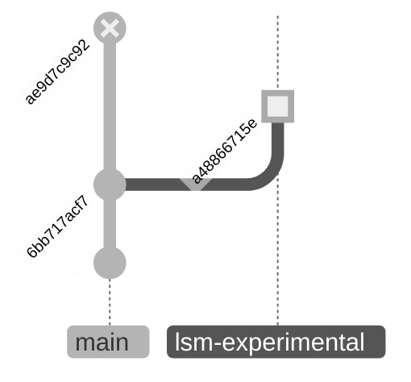

	alias ~~~=":<<'~~~sh'";:<<'~~~sh'

> [This document](https://sqlite.org/src4/doc/trunk/www/lsmusr.wiki#introduction_to_lsm) describes the LSM embedded database library and use thereof. It is part user-manual and part tutorial. It is intended to complement the [LSM API reference manual](https://sqlite.org/src4/doc/trunk/www/lsmapi.wiki).
>
> ---
>
> - A **single-writer/multiple-reader MVCC** based transactional concurrency model. SQL style nested sub-transactions are supported. Clients may concurrently access a single LSM database from within a single process or multiple application processes. 
> - An entire database is stored in a **single file on disk**. 
> - Data **durability in the face of application or power failure**. LSM may optionally use a write-ahead log file when writing to the database to ensure committed transactions are not lost if an application or power failure occurs.
> - An API that **allows external data compression and/or encryption routines to be used** to create and access compressed and/or encrypted databases.

~~~sh
mkdir sqlite && cd sqlite

# SQLite uses the fossil revision control system
fossil open https://sqlite.org/src
fossil checkout a48866715e

# only the LSM1 extension’s source files are required
git add -f ext/lsm1/*.c
git add -f ext/lsm1/*.h

# ignore the rest of the SQLite repository
echo '/lib/patch/lsm1/sqlite/' >> ../../../.gitignore
~~~

The `a48866715e` version of the LSM1 source is checked out explicitly, as that is the last SQLite commit that contains the LSM extension module:

| [Timeline](https://sqlite.org/src/timeline?c=a48866715e7be82d&y=a) |                                                              |                                                              |
| -----------------------------------------------------------: | :----------------------------------------------------------- | :----------------------------------------------------------- |
| [12:01](https://sqlite.org/src/timeline?c=ae9d7c9c922bb241&y=a) | [`ae9d7c9c92`](https://sqlite.org/src/info/ae9d7c9c922bb241) | Remove the *experimental* lsm1 extension from trunk, in as much as readers were thinking that this was a supported extension and were reporting bugs against it |
| [12:04](https://sqlite.org/src/timeline?c=a48866715e7be82d&y=a) | [`a48866715e`](https://sqlite.org/src/info/a48866715e7be82d) | Minor patch to LSM1 in an attempt to get it to build on Mac. |
| [10:54](https://sqlite.org/src/timeline?c=6bb717acf706e6ff&y=a) | [`6bb717acf7`](https://sqlite.org/src/info/6bb717acf706e6ff) | Add bounds checking and error messages and improved comments to the (unused) zorder extension function. |

